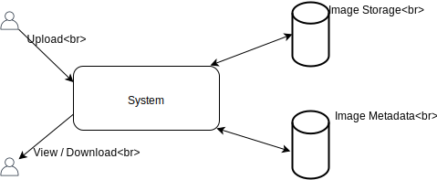

Stolen from : https://www.educative.io/courses/grokking-the-system-design-interview/m2yDVZnQ8lG

# System Features
- Users should be able to upload, download and view photos and videos.
- Users can perform searches based on the asset's title.
- Users can follow other users.
- The System should be able to generate and display a User's News Feed based on the users they follow.

# System Requirements
- The System needs to be highly available
- The max acceptable latency is 200ms
- The System should be highly reliable. No data shall be lost.
- Consistency can be eventual.

# Constrain Estimation
- Users: 5 Million
- Daily Active Users: 1 Million
- Daily Posted Photos: 2 Million (23 per second)
- Average Photo Size: 200KB
- Daily Storage: 2 Million * 200KB => 2(10^6) * 200(10^3) => 400(10^9) => 400GB
- 10 Year Storage => 400(10^9) * 365 * 10 => 1460(10^12) => 1460TB

--- 
- Daily Storage Price S3 = ($0.023 * 1GB) * 400GB = $9.2
- 10 Year Storage = $9.2 * 365 * 10 = exponential from $9.2 to $33,580 daily (Approx $12,256,700 a year)

## High level System Design
From a High level, we need to support two scenarios:
- Upload photos
- Download photos

We would also need some object storage for the images and a database server for metadata.

## Database Schema
To understand the data flow amongst components it is useful to define a DB schema at an early stage.

|                       | Photo
| -------------         |-------------
| Primary key           | id: int
|                       | userId: int 
|                       | path: varChar(256)
|                       | createdAt: dateTime
|?                      | latitude: int 
|?                      | longitude: int 

|                       | User
| -------------         |-------------
| Primary key           | id: int
|                       | name: varChar(50)
|                       | email: varChar(50)
|                       | dateOfBirth: dateTime
|                       | createdAt: dateTime
|?                      | lastLogin: dateTime
|?                      | latitude: int 
|?                      | longitude: int 

|                       | User Follow
| -------------         |-------------
| Primary key           | id: int
|                       | follower: int
|                       | following: int
|                       | createdAt: dateTime
