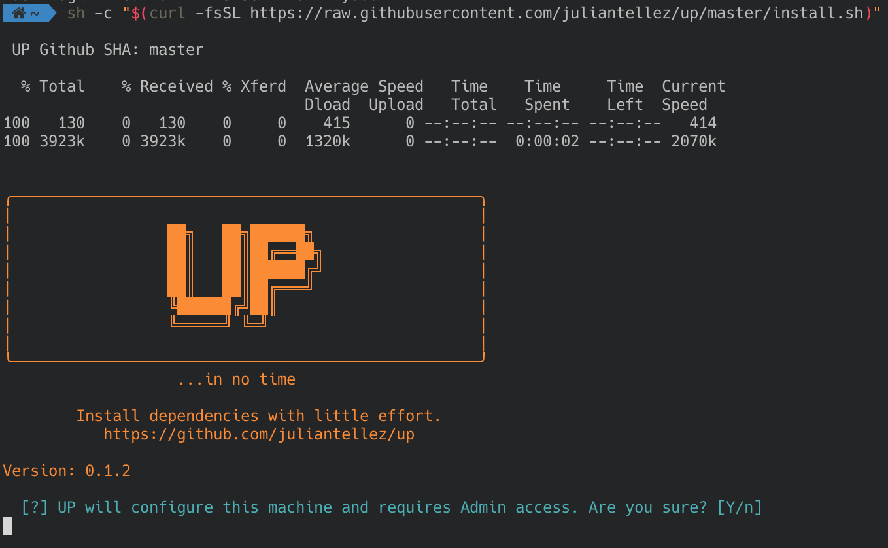

I love configuring new development machines. Over time I have collected some tools to improve my workflow and thought It would be interesting to share them here with you.

  

 

Other People’s Dotfiles (OPD).

what's the problem?

http://dotfiles.github.io/

dotfiles are the longest project you will ever work on
https://www.anishathalye.com/2014/08/03/managing-your-dotfiles/

dotfiles are not to be forked
https://zachholman.com/2010/08/dotfiles-are-meant-to-be-forked/

why do we need another configuration script?
we don't.

how is this one different?
demo
conclusion

This article was first posted on my blog at https://juliantellez.com/blog. If you found this article interesting please consider subscribing to my newsletter or following me on Twitter.
